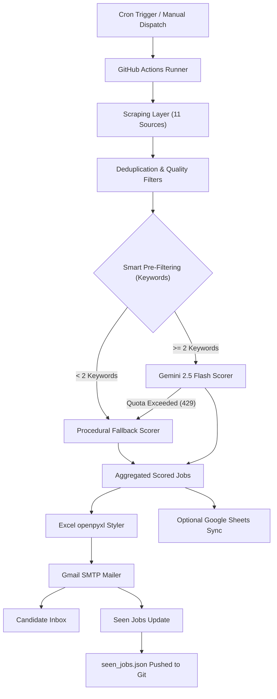

# 🎯 OpsHunt AI Daily Job Digest — System Design Document

This document outlines the **High-Level Design (HLD)** and **Low-Level Design (LLD)** of the OpsHunt Daily Job Digest scraper and email delivery system.

---

## 🏗️ High-Level Design (HLD)

The OpsHunt Daily Job Digest is a serverless, event-driven scraping pipeline designed to aggregate, filter, score, compile, and email matching DevOps/SRE jobs without hosting dependencies.

### 1. System Architecture



### 2. Core Components

- **Trigger Layer**: Runs automatically in the cloud on GitHub Actions based on a schedule (Weekdays at 11:30 AM IST, Saturdays at 10:00 AM IST) or via manual triggers.
- **Scraping Layer**: Ingests DevOps/SRE job openings concurrently from 11 distinct sources (traditional APIs, RSS feeds, open-search portals, and JobSpy).
- **Filtering & Deduplication Layer**: Cleanses raw scraping data, removes duplicates using URL parsing, applies role keyword matching, and enforces freshness rules.
- **AI Scoring Layer**: Uses a smart pre-filtering mechanism to skip Gemini API calls for weak matches (saving 70-85% in API limits). High-relevance jobs are sent to Gemini 2.5 Flash; the local procedural scorer is used as a fallback if API rate/quota limits are reached.
- **Compilation Layer**: Compiles scored jobs into a custom Deep Navy & Gold themed Excel spreadsheet with color-coded rows based on match score.
- **Delivery Layer**: Builds a custom HTML email digest with score badges and layout spacing, attaches the Excel file, and dispatches it via SMTP.
- **Persistence Layer**: Records successfully emailed job URLs in `seen_jobs.json` and pushes it back to GitHub to avoid duplicate emails.

---

## ⚙️ Low-Level Design (LLD)

### 1. Standardized Job Schema

All scraping endpoints map their raw responses into the following uniform dictionary structure before entering the filtering pipeline:

```python
job_record = {
    "title": str,           # Job title (e.g., "Senior SRE")
    "company": str,         # Hiring company name
    "location": str,        # Geographic location or "Remote"
    "is_remote": bool,      # Remote flag
    "source": str,          # Source platform identifier (e.g., "jobspy-linkedin")
    "url": str,             # Stripped application URL (no tracking parameters)
    "description": str,     # HTML-cleaned job description (max 1500 chars)
    "posted_date": str       # ISO formatted string or publication date
}
```

### 2. Module Specifications

#### A. Scraper Module (`digest.py`)
- **`make_request(url, params, headers)`**: Standard request wrapper. Enforces a `User-Agent: Mozilla/5.0 compatible` browser header, a strict `10.0` second timeout, and a single-retry policy.
- **`scrape_jobspy()`**: Dynamically inspects the locally installed version of the `python-jobspy` library to check for supported boards (e.g., LinkedIn, Indeed, Glassdoor, ZipRecruiter, Google Jobs, Naukri) and supported arguments (`google_search_term`, `hours_old`). It executes targeted searches using boolean query syntax (e.g. `(kubernetes OR terraform) -intern -support`) and handles missing/empty data rows cleanly using `.fillna("")`.
- **Feed-Specific Scrapers**: Custom logic handles mapping for Remotive, Jobicy, We Work Remotely, Otta, Arbeitnow, Naukri API, Instahyre, RemoteOK, Hacker News RSS, and Reddit RSS.

#### B. Pre-Filtering & Scoring Module (`digest.py`)
- **Smart Pre-Filter Loop**: Iterates through deduplicated jobs and scans the text for `strong_match_keywords`.
  - **Count < 2**: Bypasses Gemini API. Assigns a score of `50` and calls `calculate_local_matching()` to map missing/matching skills.
  - **Count >= 2**: Sleeps `4.0` seconds (RPM limit protection) and calls `score_job_with_gemini()`.
- **`score_job_with_gemini(job, profile, api_key)`**: Compiles the candidate profile (skills, target roles, preferred locations, target companies) into a prompt, calls Gemini 2.5 Flash, parses the JSON response, and returns the match score, matching/missing skills, and an alignment reason.
- **`calculate_local_matching(job, profile)`**: The procedural scoring engine. Evaluates keyword densities, applies remote/location bonuses (+10/15), role bonuses (+20), target company bonuses (+15), and downranks noise keywords to a score of `10`.

#### C. openpyxl Excel Compiler (`digest.py`)
- **`style_excel_sheet(excel_path)`**:
  - Sets sheet tab color to gold (`#C9A84C`).
  - Sets headers to bold white text on Deep Navy (`#1A1A2E`) fill.
  - Row colors are assigned dynamically based on score:
    - `Score >= 90`: Light Gold (`#FFF8E7`)
    - `Score 80-89`: Light Red (`#FFF0F0`)
    - `Score 70-79`: Light Green (`#F0FFF4`)
    - `Score < 70`: Alternating rows are shaded Light Grey (`#FAFAF7`) / White (`#FFFFFF`).
  - Column widths are dynamically auto-adjusted up to a maximum width of `45`.

#### D. GitHub Actions Workflow (`daily_digest.yml`)
- **Concurrency control**: Queue runs using the `opshunt-digest` group to block simultaneous runs from writing to the git repository.
- **Secrets Management**: Configuration is rebuilt at runtime from repository secrets (`CONFIG_JSON` and `SERVICE_ACCOUNT_JSON`), preventing secrets from leaking into Git.
- **Rebase-Push Lock**: If a local commit or another workflow run updates `main` during runtime, the runner discards unstaged changes (`git checkout -- .`), pulls the remote commits (`git pull --rebase`), resolves conflicts, and pushes `seen_jobs.json` safely using a 3-try retry loop with a 5-second backoff.
- **Runtime Optimization**: Enforces running on Node 24 by using `FORCE_JAVASCRIPT_ACTIONS_TO_NODE24: "true"` at the workflow level.
